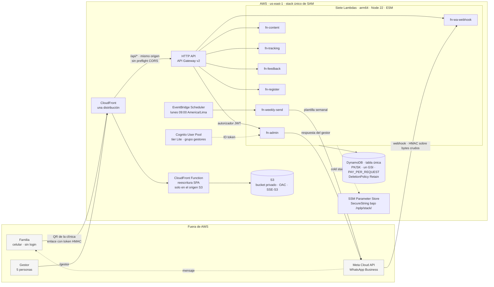
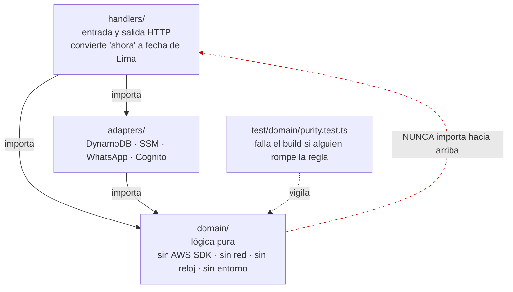
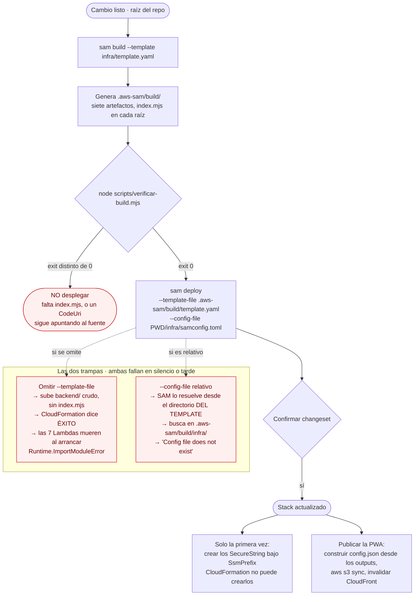
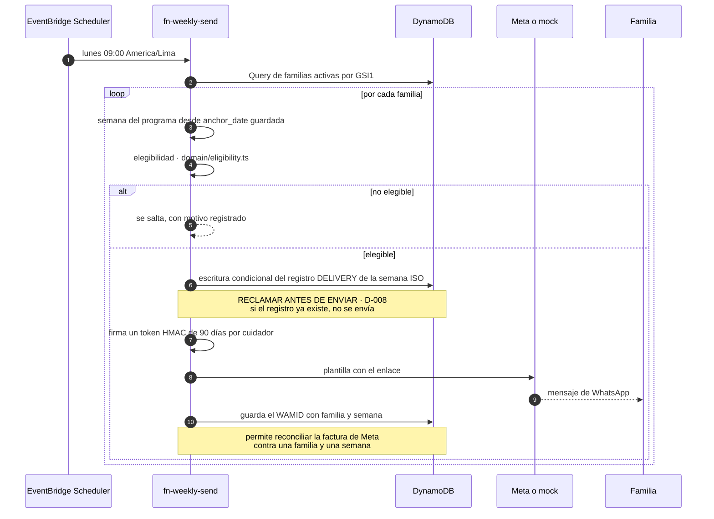
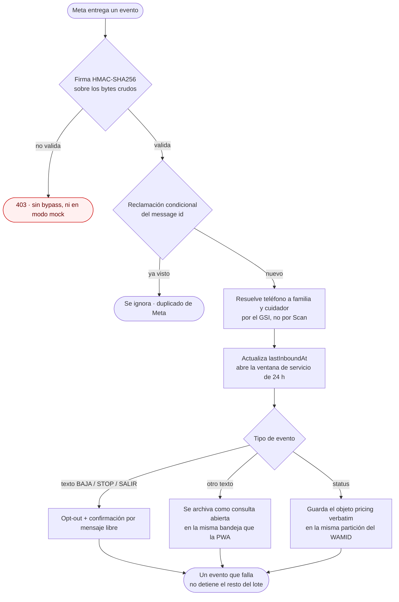
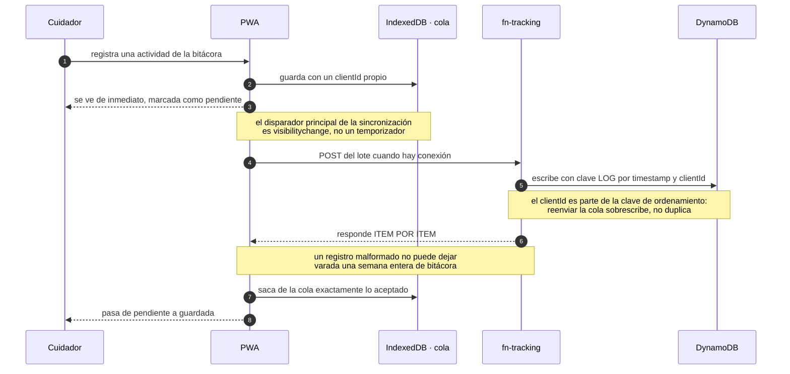
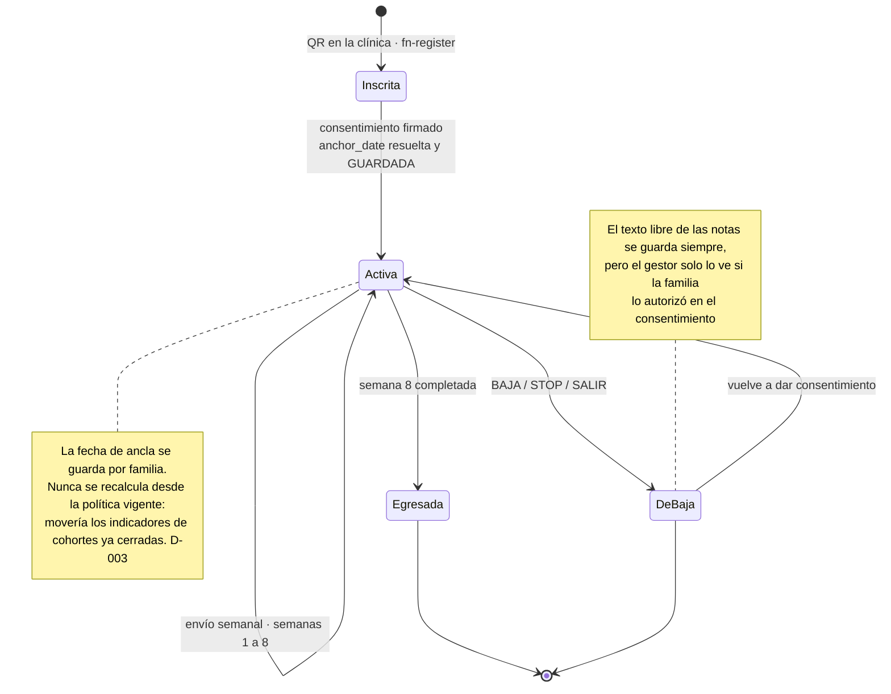

# Diagramas

Vista visual de lo que `arquitectura.md` describe en prosa. Si algo acá contradice a
[`arquitectura.md`](arquitectura.md) o a [`decisiones.md`](decisiones.md), esos dos mandan: estos
diagramas son un resumen, no la fuente de verdad.

Se renderizan solos en GitHub y en cualquier visor con Mermaid.

---

## 1. Infraestructura

Un stack, siete Lambdas, una tabla, un bucket, una distribución, un user pool.



**Por qué la API va detrás de CloudFront y no en su propio dominio:** mismo origen para la PWA y para
`/api/*`, así el navegador nunca hace preflight CORS. Una ida y vuelta menos en cada escritura, que es
justo lo que importa con la conectividad de las familias del piloto.

### Rutas y cómo se autentica cada una

| Función | Ruta | Autenticación |
|---|---|---|
| `fn-register` | `POST /api/registro` | ninguna — es el flujo del QR |
| `fn-content` | `GET /api/contenido` | token HMAC de familia |
| `fn-tracking` | `GET·POST /api/seguimiento` | token HMAC de familia |
| `fn-feedback` | `GET·POST /api/feedback` | token HMAC de familia |
| `fn-admin` | `ANY /api/gestor/{proxy+}` | JWT de Cognito **+ chequeo del grupo en código** |
| `fn-wa-webhook` | `GET·POST /api/whatsapp/webhook` | firma HMAC de Meta, sin bypass |
| `fn-weekly-send` | — | EventBridge Scheduler |

---

## 2. Capas del backend

La flecha que importa es la que **no** existe: `domain/` no importa hacia afuera. Un test de
arquitectura lo verifica en cada corrida.



De `domain/` para adentro no hay zona horaria: la semana del programa se cuenta en **días calendario**
de `America/Lima`, y la conversión ocurre en el borde.

---

## 3. Proceso de despliegue

Los tres pasos se corren desde la raíz del repositorio. Las dos banderas del `deploy` no son
opcionales: cada una evita, por separado, un despliegue que reporta éxito y deja el sistema muerto.



**Cómo reconocer la primera trampa sin leer logs:** el artefacto correcto pesa decenas de KB por
función. Si la Lambda desplegada pesa megabytes, se subió el fuente.

```bash
aws lambda get-function --function-name <stack>-ContentFunction-XXXX --query 'Configuration.CodeSize'
```

Ya ocurrió tres veces. Ver [D-018](decisiones.md) y la sección de despliegue del
[README](../README.md).

---

## 4. Proceso del envío semanal

El orden de las dos primeras operaciones es la garantía de que nadie paga dos veces.



Un envío que queda en estado `pendiente` **no se reintenta nunca de forma automática**.

---

## 5. Proceso de un mensaje entrante de WhatsApp



---

## 6. Proceso de escritura sin conexión

La bitácora y el feedback se escriben primero en el celular, no en AWS. Estas familias van a estar sin
señal buena parte del tiempo.



El historial que ve la familia mezcla lo del servidor con lo que sigue en la cola, unido por `clientId`
(D-015): nunca aparece duplicado.

---

## 7. Ciclo de vida de una familia


